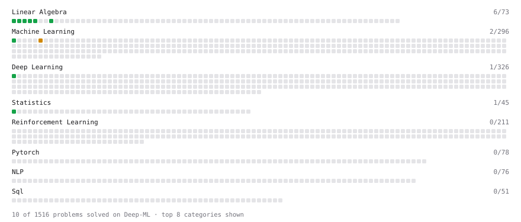

# Deep-ML

My machine learning practice from [Deep-ML](https://www.deep-ml.com). Every solution here was written by hand.

**16** solved · 16 problems · 0 labs · 0 math

[**Browse the interactive portfolio**](https://vedantachari.github.io/deep-ml/) to replay this filling in over time.

## Problems

| | Difficulty | Solved | |
| --- | --- | --- | --- |
| [Calculate 2x2 Matrix Inverse](https://www.deep-ml.com/problems/8) | easy | 2026-10-02 | [solution](problems/0008-calculate-2x2-matrix-inverse) |
| [Calculate Covariance Matrix](https://www.deep-ml.com/problems/10) | easy | 2026-10-02 | [solution](problems/0010-calculate-covariance-matrix) |
| [Calculate Image Brightness](https://www.deep-ml.com/problems/70) | easy | 2026-10-05 | [solution](problems/0070-calculate-image-brightness) |
| [Calculate Mean by Row or Column](https://www.deep-ml.com/problems/4) | easy | 2026-10-02 | [solution](problems/0004-calculate-mean-by-row-or-column) |
| [Feature Scaling Implementation](https://www.deep-ml.com/problems/16) | easy | 2026-10-04 | [solution](problems/0016-feature-scaling-implementation) |
| [Implement ReLU Activation Function](https://www.deep-ml.com/problems/42) | easy | 2026-10-05 | [solution](problems/0042-implement-relu-activation-function) |
| [Linear Regression Using Normal Equation](https://www.deep-ml.com/problems/14) | easy | 2026-10-03 | [solution](problems/0014-linear-regression-using-normal-equation) |
| [Matrix-Vector Dot Product](https://www.deep-ml.com/problems/1) | easy | 2026-10-02 | [solution](problems/0001-matrix-vector-dot-product) |
| [Reshape Matrix](https://www.deep-ml.com/problems/3) | easy | 2026-10-02 | [solution](problems/0003-reshape-matrix) |
| [Scalar Multiplication of a Matrix](https://www.deep-ml.com/problems/5) | easy | 2026-10-02 | [solution](problems/0005-scalar-multiplication-of-a-matrix) |
| [Sigmoid Activation Function Understanding](https://www.deep-ml.com/problems/22) | easy | 2026-10-03 | [solution](problems/0022-sigmoid-activation-function-understanding) |
| [Softmax Activation Function Implementation ](https://www.deep-ml.com/problems/23) | easy | 2026-10-03 | [solution](problems/0023-softmax-activation-function-implementation) |
| [Transpose of a Matrix](https://www.deep-ml.com/problems/2) | easy | 2026-10-02 | [solution](problems/0002-transpose-of-a-matrix) |
| [Calculate Eigenvalues of a Matrix](https://www.deep-ml.com/problems/6) | medium | 2026-10-04 | [solution](problems/0006-calculate-eigenvalues-of-a-matrix) |
| [Matrix Transformation ](https://www.deep-ml.com/problems/7) | medium | 2026-10-04 | [solution](problems/0007-matrix-transformation) |
| [Principal Component Analysis (PCA) Implementation](https://www.deep-ml.com/problems/19) | medium | 2026-10-02 | [solution](problems/0019-principal-component-analysis-pca-implementation) |

---

_This file is regenerated by Deep-ML on every push._
